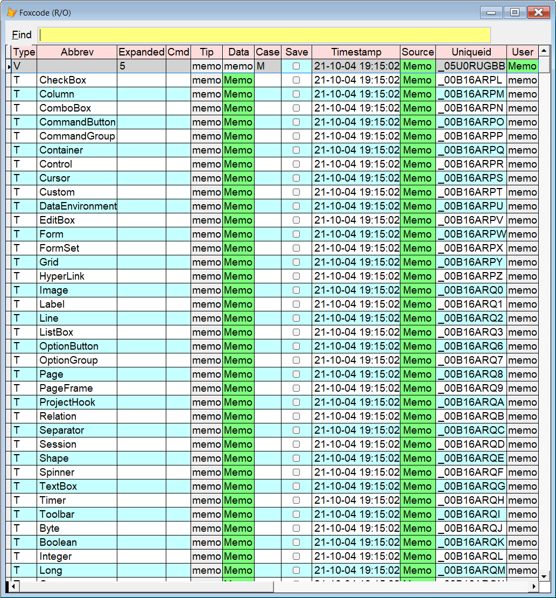

[](../README.md)

## `BR` (Browse)


| You type:                |        Result after pressing  |
|:-------------------------|:----------------------------------------------------------|
| `br`                       | The currently selected table is shown in `Sidekick's` grid form |
| `brw`      | Same as above, except the grid is writable |
| `br /w` | Same as above |

Note that `br` gives a read only grid, use `brw` to enable editing.

The grid has advanced incremental search; only record where all the given "words" are anywhere in any field, including numeric and memo fields.

This what you see if you issue 
```foxpro
Use (_foxcode) Again
Br (Press F8)
```
</br>  



**Note:** In this documentation  is consistently used as the hotkey for `Sidekick`. It can easily be changed by using one of [Thor's](https://github.com/VFPX/Thor) tools. 

