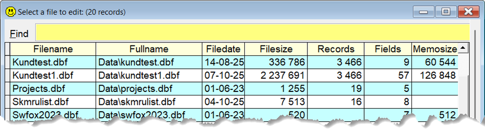

## `BR` (Browse)

| You type:                |        Result after pressing  |
|:-------------------------|:----------------------------------------------------------|
| `br`                       | The currently selected table is shown in `Sidekick's` grid form |
| `br x` | Tables with `x` in their names are listed. Highlight one and press `Enter` to see all its records. |
| `br *` | Lists all the DBF's in your path. |
| `br ?` | Same as above. |
| `brw`      | Same as above, except the grid is writable |
| `bri`  | Read only grid, plus numeric, character, date and datetime fields are indexed| | `brwi` | A combination of `brw` and `brw`|

Note that `br` and `bri` give a read only grid, with no delete marks. 
With the commands `brw` and `brwi` the grid will be read/write grid with delete marks.  

About `bri` and `brwi`: If the current work area contains a read/write cursor, these variants will create index tags for all "indexable" fields, before the Sidekick Form shows up. For tables (DBF's) and read only cursors, no index tags are added.

The grid has advanced incremental search. This means that it will only show record where all the given "words" are anywhere in any field, including numeric and memo fields.

With the command `BR*`, you will see something like this:

**Note:** In this documentation  is consistently used as the hotkey for `Sidekick`. It can easily be changed by using one of [Thor's](https://github.com/VFPX/Thor) tools. 

