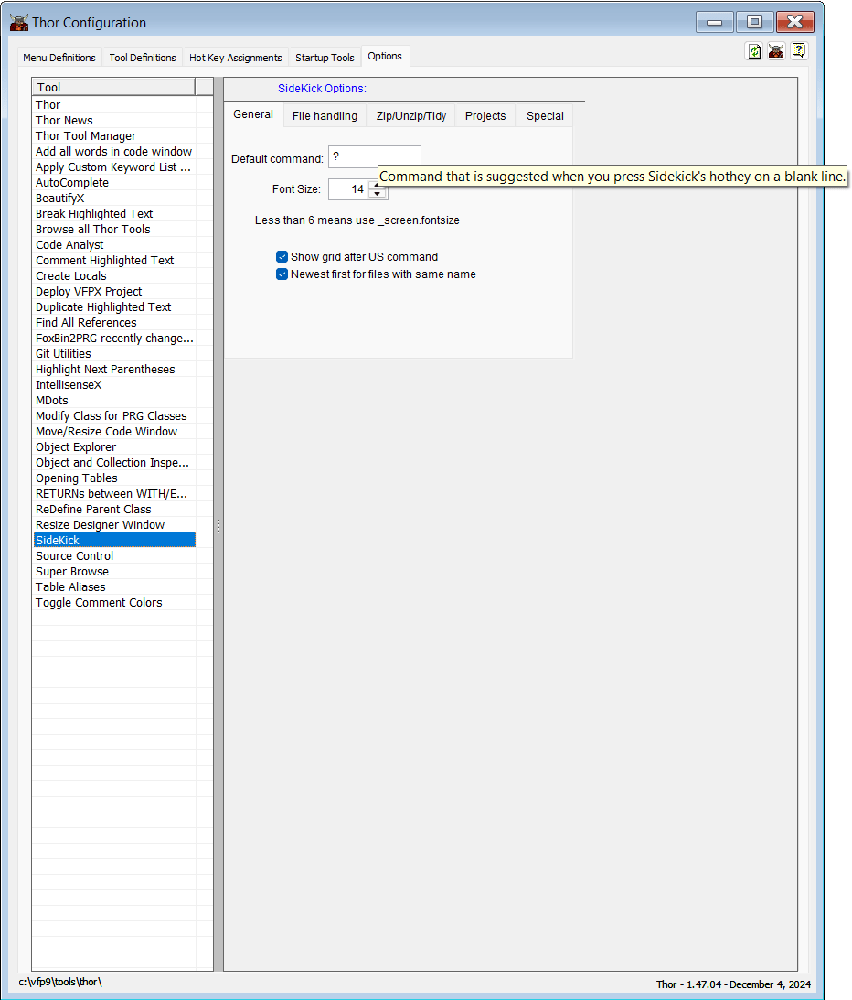

## Configure `Sidekick`

To fine tune Sidekick to match your needs and wishes, open Thor Tools (Alt+F12), select the right tab (Options) and Sidekick.  

All the different choices have Tooltips to describe their purpose.  

**Note:** In this documentation  is consistently used as the hotkey for `Sidekick`. It can easily be changed by using one of [Thor's](https://github.com/VFPX/Thor) tools.

## Detailed description of the options:  

### Page 1, general:

1. **Default command:** Default is `?`. The `Sidekick` command that is suggested when you press  from a blank line. The default value, `?`, means that if you press `Enter`, you will see a list of all the available commands. 
2. **Font size:** Self explanatory. A value of 6 or less means that the font size value is read from _screen.
3. **Show grid after US command:** When checked, `Sidekick US` commands will show a grid after selection is done.  
4. **Newest first for files with same name:** When checked, files with the same name will show the newest version first.

### Page 2, File handling:  

1. **Path returned:** Files' path are shown and returned in three different ways:  
    1. Relative path
    2. Full path
    3. No path  
2. **Case returned:** Files' name are shown and returned in three different ways:
    1. lower case
    2. Proper Case
    3. UPPER CASE
3. **MRU table for ED command:** Default is `SKMRUList`. With `Sidekick's ED` function you can maintain a `MRU` (`Most Recently Used`) list of your own. This can be done by using the appropriate `Sidekick ED` commands, or you can do it manually by browsing this table. The name of the table is specified in this field, `.dbf` is added automatically.

### Page 3, Zip/Unzip/Tidy:  
1. **Length of number in Zip and Tidy feature:** Default is `4`. The number of digits added to the filename for consecutive operations of `Sidekick's Zip` and `Tidy` functions. The default value, 4, means that the filename will go from SKZip_0001.zip to SKZip_9999.zip. The "base" part of the filename, SKZip_, can be changes, see `Target template for zip files` below.
2. **Backup folder:** Default is `Bu?`. The filename "skeleton" used for folders in `Sidekick's Tidy` function. Files included in a `tidy` operation will be zipped and moved to this folder. If this value ends with a question mark, `?`, today's date in the format `yymmdd` will replace the `?`.  
3. **Unzip folder:** Default is `SKUnzip`. The folder name used for `Sidekick's Unzip` feature if none is specified.
4. **Target template for zip files:** Default is `SKZip_`. The "base name" for the filename used for `Sidekick's Zip` and `Tidy` function. This value, together with the value in the field `Length of number in Zip and Tidy feature`, is used by `Sidekick` to construct the result file name. The extension `.zip` is automatically added.  
**Note:** If this value ends with a question mark, `?`, the current date in the format `yymmdd` will replace the `?`.
5. **Necessary delay for zip creation (mS):** Default is `100`. `Sidekick` need a little time to prepare a `.zip` file before it's filled with data. Increase this number if the operation fails.

### Page 4, Projects:  
1. **Sidekick active project file:** Default is `SKOptions.sk`. This file is used in `Sidekick's` project feature, as described in [`Sidekick` group of files organizer](skorg.md). Change the name here, or use the options specified in the document referred to.
2. **Command to Run instead of opening a file:** Default is `exe`. This string is used in `Sidekick's` project feature, [`Sidekick` group of files organizer](skorg.md). Change this value if the default string `exe` causes any conflict.  
3. **Max number for Description in .sk-file:** Default is 15. `Sidekick` uses some time to look for `description` text in the defined format in files. The earlier it appears, the faster is the process. This value specifies how many lines to process before the rest of the file is ignored.
 
### Page 5, Special:
1. **Location (URL) for Help files:** Default is `https://github.com/tbleken/sidekick`. This is the "base" URL for all of `Sidekick's` help files. Change this value only if the files are moved.
2. **Wait timeout (seconds):** Default is `3`. Most `Sidekick` messages will timeout automatically after the number of seconds specified. Increase it if necessary, and if you don't want these messages, set it to `0` (zero).

