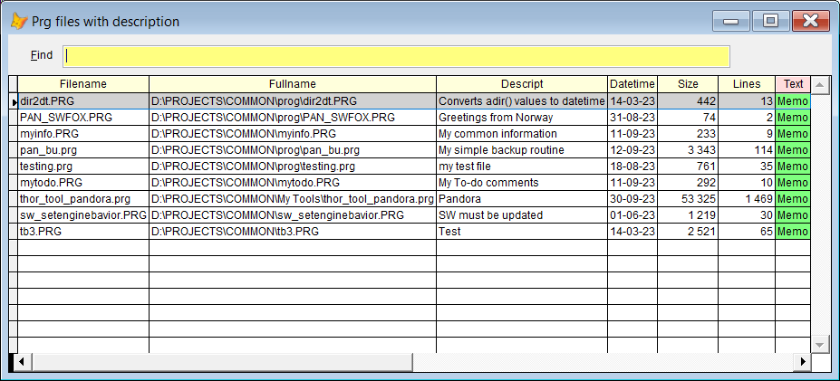

## Descriptions in your prg's

**Sidekick** keyword: `Desc`

If your program files contains a description in one of the ten first lines, **Sidekick** has tools to make your life easier. The description must match this format:  

`* Description: Some text *`

#### Syntax samples: 

| Window | You type: | Short version |  Result after pressing |
|-------|:--|:--------|:----------------------|
| C | `Desc`  | `De`        | You get a list of all prgs in your path which have a description|
| C | `Desc aaa` | `De aaa`|  List of files where the descriptions contains `aaa`|
| E | `Desc` | `De` | A `* Description *` template is added in the current line (line 15 or less)|

`C`: Command Window  
`E`: Any VFP editor, normally Modify Command  

**Note:** In this documentation  is consistently used as this hotkey for `Sidekick`. It can easily be changed by using one of [Thor's](https://github.com/VFPX/Thor) tools. 

