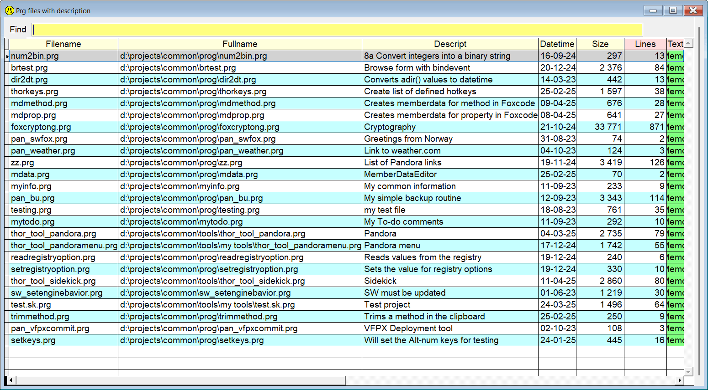

## Descriptions in your prg's

**Sidekick** keyword: `Desc` or the shorter version `De`

If your program files contains a description in one of the ten first lines, **Sidekick** has tools to make your life easier. The description must match this format:  

`* Description: My descriptive comment *`

#### Syntax samples: 

**In theCommand window:**  

|You type: |  Result after pressing |
|:--|:----------------------|
| `Desc`  | You get a list of all prg's in your path which have a description|  
| `De`  | Same as above|  
|`Desc aaa` |  List of files where the descriptions contains `aaa`|
| `De aaa`  | Same as above|  
  
**In any of FoxPro's editor windows:** 

|You type:  |  Result after pressing |
|:--|:----------------------|
|`Desc` | A `* Description *` template is added in the current line (line 15 or less)|
| `De`  | Same as above|  

**Note:** In this documentation  is consistently used as the hotkey for `Sidekick`. It can easily be changed by using one of [Thor's](https://github.com/VFPX/Thor) tools. 

