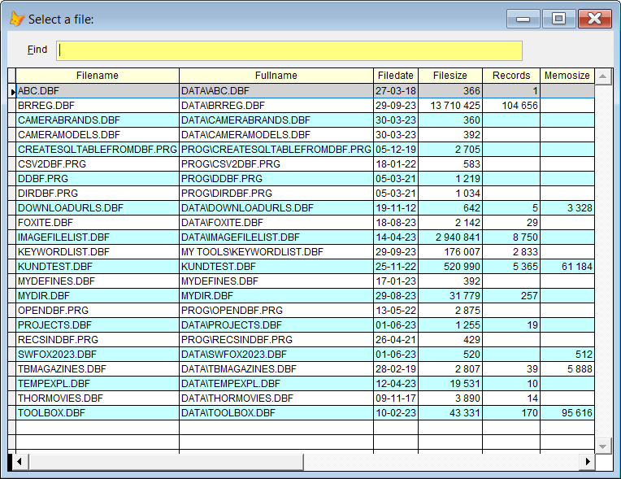
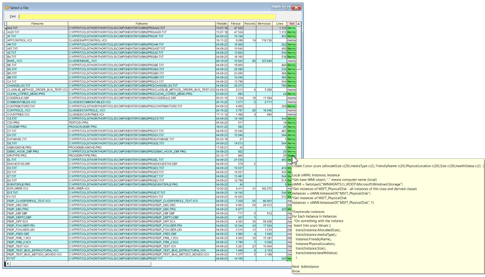

## File Picklists (advanced Dir)</a>  

**Sidekick** comes with a nice "file finder" with several options. For instance it will show the number of records in all DBF's plus the size of the corresponding memo file.    

To start with a more limited selection of files, you can specify one or more "words" from the file name. If the "words list" contains a `.` (dot), you can also specify the extension. In that case also non VFP files are included in the search.  

All the commands have two version, one "long" and one "short", these are interchangeable.

This tool comes in three variants:

***Note 1:*** These commands only work in the command window, and in editors opened by Modify Command or Modify File. 

**Note 2:** In this documentation  is consistently used as this hotkey for `Sidekick`. It can easily be changed by using one of [Thor's](https://github.com/VFPX/Thor) tools. 

# #1: Dr (or *): Will open files for editing

| Command| Short version            |        Result after pressing       |
|:--|:-----------------------|:----------------------------------------------------------|
|dr| \* (or \*:)                     | Picklist of all VFP files in the path, for editing |  
|dr bb| \* db  (or \*: dbnote 1)                 | As above, only files having `db` in its name *or* extension|
|dr db cust | \* db cust       | All files with names containing  `db` *and* `cust` |  
|dr my .prg | \* my .prg          | All files with `my` in the name *and* `prg`as extension|
| dr .png | \* .png             | All files `.png` files |
| dr \?  | \* ? | All files in the current VFP path |
| \* \*  | dr \* | Same as above |
|dirx| +, \*\* (or **: note 1)             | Same as Dr, with more information, se below|  
|dirrun|++, \*\*\* (or ***: note 1)               | Same as DirX, will run file|  

### Note 3: 
In order **not** to "collide" with comments in the editor windows, the short form of the syntax **must** include the colon (**:**) after the asterisk(s), unless you specify additional "parameters".  
In the command window this colon is optional.

<a id="dirc">  

# #2: DirX (or **): Like #1 with much more information </a>

`dirx` or `**` adds several more columns, and more information:  
* **Lines column:** the number of lines in all .txt, .prg, .h and .pan files
* **Text column:** the content of the files as mentioned above   
* **Memosize column:** the size, in bytes, of the corresponding memo files.  
* In addition, the record size information is filled in for **all** VFP tables, including .dbc and .*x files. This can be very handy for analyzing the complexity of applications.

This gives two big advantages:  
1. Hover the mouse over the field `text`, and you will see the file contents as a tooltip.
1. The incremental search also includes the contents of the files.

Note that the syntax is identical to `Dr` and the short form `*`.  

<a id="dirrun">   
# #3: Dirrun (or ***): Will *run* forms and programs </a>

Syntax is identical to #1 and #2. This variant will show the information as DirX, but only prg and scx files are listed. When you press `Enter`, **Sidekick** will try to `run` the selected file. 
 
## A quick summary of the shortest and most common versions:  
| You type | Used to |
|:--|:--|
|* |  locate VFP files quickly, and modify them |
| **| same as above, with more info, but slower|
| ***| locate VFP files, and run them|

**Note 4:** Add a colon (:) in a Modify Command/File window!

