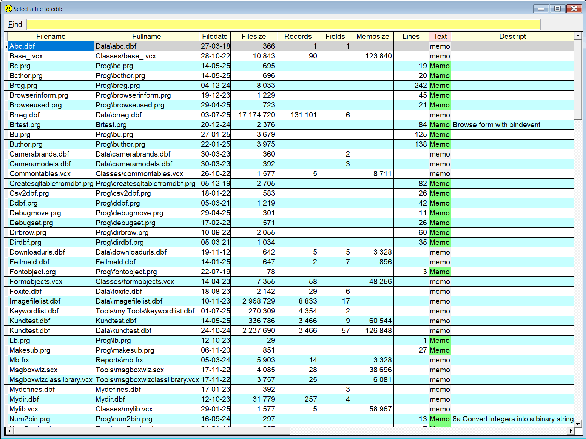

## File Picklists (advanced Dir)</a>  

**Sidekick** comes with a nice "file finder" with several options. For instance it will show the number of records in all DBF's plus the size of the corresponding memo file.    

To start with a more limited selection of files, you can specify one or more "words" from the file name. All listed words, separated by a space, must be present in the filename or path of the listed files.  

If one of the words is `.` (dot), also non VFP files are included in the search. To get only files of one type, start with a `.` (dot). For instance `.zip` will only show zip files.

When the list shows up, you can filter it even further, each "word" you type must be present in what you see or inside the memo fields. Also numeric fields and date fields are included in the filtering process.

This tool comes in three variants:

# Version #1, `+` (or `dr`) : Will open files for editing

| Command        |        Result after pressing       |
|:--|:----------------------------------------------------------|
|`dr`                   | Picklist of all VFP files in the path, for editing |  
|`+`                     | Same as above |  
|`dr db`|  As above, only files having `db` in its name *or* extension|
|`+ db`               | Same as above |  
|`dr db cust` |  All files with names containing  `db` *and* `cust` |  
|`dr my .prg` |  All files with `my` in the name *and* `prg`as extension|
| `dr .png` | All `.png` files |
| `dr .png arr` | All `.png` files with `arr` in the name |
| `dr *`  | Absolutely all files are shown  |
| `dr * abc def`  | All files with `abc` *and* `def` in the name or extension  |

**Note** that the `+` version only works in the command window! The reason is that `+` is also used as a short version for `Sidekick's` [Ins](skins.md) command. If you need this functionality from one of VFP's program editors, you can use `dr` instead. Or even better, use the enhanced version `++` which gives much more information, see next paragraph for details.

<a id="dirc">  

# Version #2, `++` (or `drx`) : Like #1 with many more information </a>

Version 2 adds several more columns, and more information:  

* **Lines column:** the number of lines in all .txt, .prg, .h and .sk files
* **Text column:** the content of the files as mentioned above   
* **Memosize column:** the size, in bytes, of the corresponding memo files.  
* In addition, the record count is filled in for **all** VFP tables, including .dbc and .*x files. This can be very handy for analyzing the complexity of applications.

This gives three big advantages:  
1. Hover the mouse over the field `text`, and you will see the file contents as a tooltip.
1. The incremental search also includes the contents of the files.
2. `++` works in all of VFP's editors, including the Command window.

Note that the syntax is identical to `+`. This means that unless you have a slow computer, slow network connection or extremely many files, it's recommended to always use the `++` version. 

<a id="dirrun"> 

# Version #3, `+++` (or `drr`) : Similar to version #2, `++`, except it will *run* forms and programs </a>

Syntax is identical to #1 and #2. This variant will show the same information as `++`, but only .prg and .scx files are listed. When you press `Enter`, **Sidekick** will try to `run` the selected file. 

 
## A quick summary:
* `+`: will show a picklist of all VFP "main" files
* `++`: Like `+` but with more info
* `+++`: Like `++` but will only show .prg and .scx, selected file will be `run`, if possible.

## Special mode:

To help you inspect your class libraries (vcx files), this tool has a special "hidden" mode.

| Command        |        Result after pressing       |
|:--|:----------------------------------------------------------|
|`dr .vcx `                     | Adds column `classes`  |  
|`+ .vcx `                     | Same as above  |  
|`drx .vcx `                     | Same as above plus columns for records and fields  |  
|`++ .vcx `                     | Same as above|  

Hover the mouse over the column Classes to see the list of classes as tooltips. Click the green button `Memo` to get a better "view".

**Note** that the `+` version only works in the command window!

This picture shows the result of the second version, `++ .vcx`:

**Note ** In this documentation  is consistently used as the hotkey for `Sidekick`. It can easily be changed by using one of [Thor's](https://github.com/VFPX/Thor) tools. 

<!-- Secret mode: `++ .vcx /l`  -->
