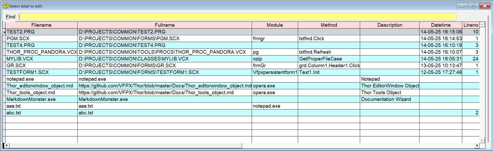

## `ED` (EDit file)

### A quick way to open several types of files, not only VFP files  

This tools shares a lot of features with the "other" directory functions,  [`++`](../../Pandora/documents/pandir.md), but it also has several unique features.  

In "dir mode" you simply type `ed`, and press . This will present a list of **all** files in your path. Select one, and `Sidekick` will try to open it.  

If you add more text, for instance `ed ab de`, only files whose file name contain all the additional "words", separated by a space, will be listed.  

When the list is active, you can filter the list further by typing more "words". Only files which has all the words somewhere in their name, path or any of the other columns, will appear.  

In some cases you will see a column containing a memo field from the underlying cursor. In those cases even the contents of the relevant memo fields, shown in green, are checked. And if you hover the mouse over one of the green cells, you can see the contents as a tooltip. Double-click to see the memo field in a separate window. 

| You type:                |        Result after pressing           |
|:-------------------------|:----------------------------------------------------------|
| `ed` | With no parameters, **all** files in the path is in the list |
| `ed *` | Same as above |
| `ed ?` | Same as above |
| `ed br` | Only files with `br` in its name are listed. |
| `ed br` | If only one file VFP "first class" file  is found, it is opened |
| `ed br` | If no file is found, `br.prg` is assumed |
| `ed br .prg` | Same as above, only .prg files  |  
| `ed br.prg` | Only files matching *br.prg are listed | 
| `ed .prg` | List of all .prg files is shown |
| `ed .vcx` | List of all .vcx files is shown |
| `ed pg.vcx`| File pg.vcx (if unique name) is opened in Class Browser|
| `ed pg.vcx.form1` | Class form1 in pg.vcx' is opened in form designer|
| `ed pg.vcx.form1.init` | Same as above, init method is opened in method editor|
| `ed pg.vcx.form1.init:20` | Same as above, cursor is positioned on line 20 (or last line)|
| `ed https://github.com/tbleken/Sidekick`| The URL is opened in default browser|
| `ed D:\Doc\MyDocs\MyDocument.docx`| The document is opened in the default application |
| `ed C:\Windows\Notepad.exe`| Notepad opens |
| `ed Notepad.exe`| Same as above, if notepad.exe is in Windows' path |

Please observe that if only **one** file matches the selection criteria, no list will appear and the matching file will be opened.  

## List of your most frequently modified files and modules.  

To get quick access to your "favorite places", `Sidekick` creates a table, default name is SKMRUList.dbf. You can easily add and remove entries, and show a picklist. 

| You type:                |        Result after pressing           |
|:-------------------------|:----------------------------------------------------------|
| `ed+`     | The necessary data to re-open the code window is stored |
| `ed-`  | The record for the code window is hidden by setting Active to .F. |
| `ed?`  | You get a picklist of earlier entries in the table | 
| `??` | Same as above |
| `ed? init`  | Same as above, only entries with `init` in any field are shown  |
| `?? init`  | Same as above|
| `ed? .prg`  | Same as above, only .prg files are shown  |
| `ed? /a` | Shows all records, also where Active = .F. |
| `ed? /e` | Shows only records where External = .T. |
   
   

`ed+` will add a new record if it's not already there. The datetime field will be updated, and the Active field will be set to .T.  
The procedure is very simple: You open any editor (not the command window), type `ed+` and press . This will add the necessary data to re-open the same item. If necessary a new record will be created. 

`ed-` will set the active field to .F. which will effectively hide it from the list. Also the datetime field will be updated. The procedure is exactly the same as for `ed+`; type `ed-` in an editor, and press .  

`ed?` should be self explanatory. Note that the list is sorted on the datetime field, in descending order.

**Technical:** This utility is based on a table, `SkMRUList.dbf` by default. The name of this table can be changed, see value `MRU table for ED command` in [Sidekick options](skconfig.md).  

This table has the following fields:  

| Name | Type | Description  |  
|:-----|:-----|:-------------|  
| Fullname | c(240) | Full path to the file in question |
| Module   | c(100) | Name of class, module or program to open the file |
| Method   | c(40)  | Name of method (in .vcx or .scx) |
| Lineno   | int    | Line number in method or .prg |
| Descript | c(40)  | Description |
| Datetime | T      | Date and time for last "update" (see `ed+` above) |
| Active   | L      | .F. will hide the record, unless command `ed? /a` is used |
| External | L      | .T. means "no-VFP" files |  

For "external" "files", there rules apply:
* To run external programs, the name of the executable file goes into `Fullname`
* If the external program needs parameters, the name goes into `module` and the parameters goes into `fullname`
* URL's or data files goes into `fullname` if you want Windows' default programs to open them.    

Here are a few samples of what goes where in `SkMRUList.dbf`:  

| Fullname | Module | Method | Line | Ext | Note |
|:---------|:-------|:-------|-----:|:--|:-----| 
| d:\my\my.prg |    |        | 10   |.F.||
| d:\my\my.vcx | myclass | init | 5 |.F. ||
| d:\my\my.scx | myform | Header1.Click | 15 |.F.||
| Notepad.exe  ||||.T.||
| mytext.txt | ||10|.F.| Modify File |
| mytext.txt | Notepad.exe||| .T.| Notepad  |
| https://mysite.com/page1 ||||.T.| Default browser |
| https://mysite.com/page1 | opera.exe |||.T.| Specific browser |

**Note:** In this documentation  is consistently used as the hotkey for `Sidekick`. It can easily be changed by using one of [Thor's](https://github.com/VFPX/Thor) tools.

For more tips on this feature, check [Your "busy files" list `Sidekick.sk`](skorg.md)