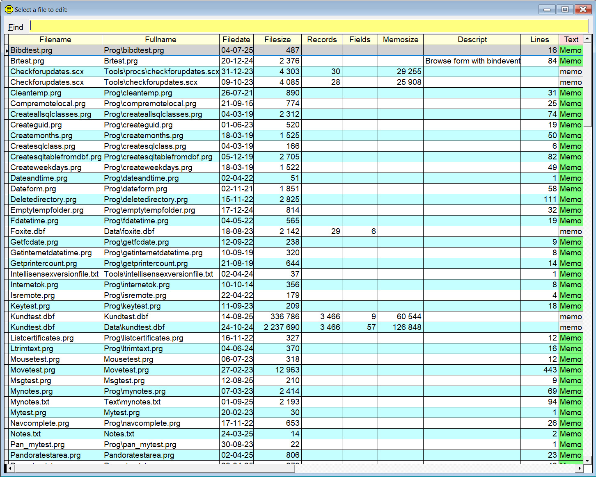

## `ED` (EDit file)

### A quick way to open several types of files, not only VFP files  

This tools shares a lot of features with the "other" directory functions,  [`++`](../../Pandora/documents/pandir.md), but it also has several unique features.  

In "dir mode" you simply type `ed`, and press . This will present a list of **all** files in your path. Select one, and `Sidekick` will try to open it.  

If you add more text, for instance `ed ab de`, only files whose file name contain all the additional "words", separated by a space, will be listed.  

When the list is active, you can filter the list further by typing more "words". Only files which has all the words somewhere in their name, path or any of the other columns, will appear.  

In some cases you will see a column containing a memo field from the underlying cursor. In those cases even the contents of the relevant memo fields, shown in green, are checked. And if you hover the mouse over one of the green cells, you can see the contents as a tooltip. Double-click to see the memo field in a separate window. 

| You type:                |        Result after pressing           |
|:-------------------------|:----------------------------------------------------------|
| `ed` | With no parameters, **all** files in the path is in the list, less info |
| `ed *` | Same as above |
| `ed ?` | Same as above |
| `ed br` | Only files with `br` in its name are listed. |
| `ed br` | If only one file VFP "first class" file  is found, it is opened |
| `ed br` | If no file is found, `br.prg` is assumed |
| `ed br .prg` | Same as above, only .prg files  |  
| `ed br.prg` | File `br.reg` is opened or created | 
| `ed .prg` | List of all .prg files is shown |
| `ed .vcx` | List of all .vcx files is shown |
| `ed pg.vcx`| File pg.vcx is opened in Class Browser|
| `ed pg.vcx.form1` | Form1 in pg.vcx' is opened in form designer|
| `ed pg.vcx.form1.init` | Same as above, init method is opened in method editor|
| `ed pg.vcx.form1.init:20` | Same as above, cursor is positioned on line 20 (or last line)|
| `ed 0` | Opens `Sidekick's` "busy files" list, see below |
| `ed 5` | "Runs" group 5 in `Sidekick's` "busy files" list  |
| `ed -` | "Runs" "default group" in `Sidekick's` "busy files" list |
| `ed C:\Windows\Notepad.exe`| Notepad opens |
| `ed Notepad.exe`| Same as above, if notepad.exe is in Windows' path |
| `ed !https://github.com/tbleken/Sidekick`| The URL is opened in default browser|
| `ed !D:\Doc\MyDocs\MyDocument.docx`| The document is opened in the default application |
             
In the last samples, note the exclamation mark `(!)` preceding the parameter. The reason is that the text needs to be passed as a parameter and not as a command. 

### Special case: 
`ed` followed by a number will perform the corresponding action as described in [`Sidekick` "group of files organizer"](skorg.md).  
This means that if you type for instance  `ed 5` and press , the line(s) beginning with `5` are processed.  
If the number is 0, IOW `ed 0`, the whole list is opened for inspection and editing.  

For more tips on this feature, check [Your "busy files" list `Sidekick.sk`](skorg.md)

Please observe that if only **one** file matches the selection criteria, no list will appear and the matching file will be opened.  

**Note:** In this documentation  is consistently used as the hotkey for `Sidekick`. It can easily be changed by using one of [Thor's](https://github.com/VFPX/Thor) tools.

