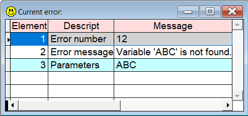

## `ER` (Error)

If your code has generated an error, this command will show the result of the array generated by AError().

When you have an error:

| You type:                |        Result after pressing  |
|:-------------------------|:----------------------------------------------------------|
| `er`                       | The contents of the array generated by AError() is shown |
| `err`      | Same as above|

After the grid is closed, the error is cleared from VFP's memory.  

**Note:** In this documentation  is consistently used as the hotkey for `Sidekick`. It can easily be changed by using one of [Thor's](https://github.com/VFPX/Thor) tools. 
