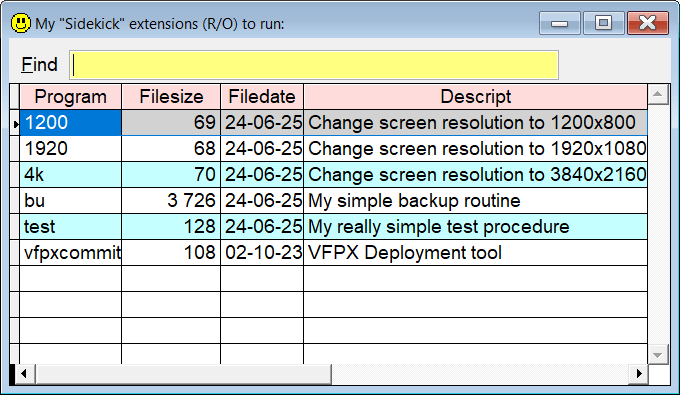
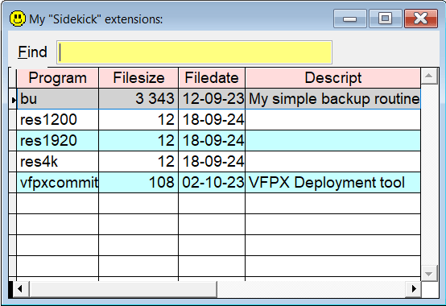

[](../README.md)

## Create your own `Sidekick` extensions

The key to using your own `Sidekick` extensions, is to remember the `!` symbol, aka exclamation mark. It's easy to remember since "VFP uses `!` as shortcut for **run**".  

All `Sidekick` extensions must be named `sk_xxx.prg` where `xxx` is the name of the tool.  

**Note:** In this documentation  is consistently used as the hotkey for `Sidekick`. It can easily be changed by using one of [Thor's](https://github.com/VFPX/Thor) tools. 

#### To create a `Sidekick` extension:  

Let's say you want to create a **Sidekick** extension called `xxx`. To create this tool, type `sk xxx` or `!xxx`, and press . You are told that the file doesn't exist, and asked if you want to create it. If you confirm, the file is created in one of the following folders:

1. `prog` (if it exists)
1. `prg` (if it exists)
1. the current "root" folder  

Write the code you want, and save it.

#### To "run" a `Sidekick` extension:  

Type an exclamation mark (`!`) and the name of the extension, like `!xxx`, and press . **Sidekick** will locate the file and run it.  
Any additional characters will be passed to the program as a text string.  
You can even leave out the exclamation mark, `!`. This makes it possible to override a **Sidekick** command, which may, or may not, be what you want to do!

One sample: You have a program called `sk_4k.prg`, see below. This program sets the screen resolution to 4K (3840x2160). To run this program, all you have to do is type `4k` and press .    

#### To see a list of all your **Sidekick** extensions:

| Command|       Result after pressing              |
|:---|:----------------------------------------------------------|
| sk |Lists all your **Sidekick** extensions|
| ! | Same as above |

Select the one you want, and press **Enter** to run it.  




If you know the name of the `Sidekick` extension:

| Command|  Result after pressing  |
|:---|:----------------------------------------------------------|
| sk xxx |  `Sidekick` extensions sk_xxx is run|
|! xxx |  Same as above |
|!xxx |  Same as above, space not necessary with this version |

If there is no file matching `sk_xxx.prg`, it is created as described above.

<a id="sked">

#### To modify or create a `Sidekick` extension:  </a>

| Command |      Result after pressing |
|:-------|:----------------------------------------------------------|
| sked <sub>Note 1</sub> | Lists all **Sidekick** extensions|
| !! | Same as above |
| sked xxx <sub>Note 2</sub> | File `sk_xxx.prg` is opened in the editor |
| !! xxx | Same as above |
| !!xxx |Same as above, space not necessary with this version |

Note 1: Select the one you want to edit, and press **Enter**.  
Note 2: If the named **Sidekick** extension means a non existent file, you get an error.  


  
 
### Sample Sidekick Extension

This program, `sk_4k.prg`, changes the screen resolution to 3840x2160.  

To run it, type `4k` in the command window, and press .

This is the contents of `sk_use.prg`:

```foxpro
* Description: Change screen resolution to 3840x2160 *
Do changeres && Default is 3 which gives 3840x2160
Function ChangeRes
  Lparameters tnWidth, tnHeight
  m.tnWidth = Evl(m.tnWidth, 3)
  Do Case
  Case m.tnWidth = 1
    m.tnWidth = 1200
    m.tnHeight = 800
  Case m.tnWidth = 2
    m.tnWidth = 1920
    m.tnHeight = 1080
  Case m.tnWidth = 3
    m.tnWidth = 3840
    m.tnHeight = 2160
  Otherwise
  Endcase
  Local lnWidth, lnHeight, lnModeNum, lcDevMode
  m.lnModeNum  = 0
  m.lcDevMode  = Replicate(Chr(0), 156)
  m.lnWidth    = Iif(Empty(m.tnWidth), 800, m.tnWidth)
  m.lnHeight   = Iif(Empty(m.tnHeight), 600, m.tnHeight)
  Declare Integer EnumDisplaySettings   In Win32API ;
    String lpszDeviceName,;
    Integer iModeNum, ;
    String @lpDevMode

  Declare Integer ChangeDisplaySettings In Win32API String @lpDevMode, Integer dwFlags
  Do While EnumDisplaySettings(Null, m.lnModeNum, @m.lcDevMode) <> 0
    m.lnModeNum = m.lnModeNum + 1
  Enddo
  m.lcDevMode = Stuff(m.lcDevMode,  41, 4, LongToStr(1572864))
  m.lcDevMode = Stuff(m.lcDevMode, 109, 4, LongToStr(m.tnWidth))  && Ancho
  m.lcDevMode = Stuff(m.lcDevMode, 113, 4, LongToStr(m.tnHeight))  && Alto
  ChangeDisplaySettings(@m.lcDevMode, 1)
Endfunc

Function LongToStr
  Lparameters lnLongVal
  Local lnCnt, lcRetStr
  m.lcRetStr = []
  For m.lnCnt = 24 To 0 Step - 8
    m.lcRetStr = Chr(Int(m.lnLongVal /(2^m.lnCnt))) + m.lcRetStr
    m.lnLongVal = Mod(m.lnLongVal, (2^m.lnCnt))
  Next
  Return m.lcRetStr
Endfunc
```
