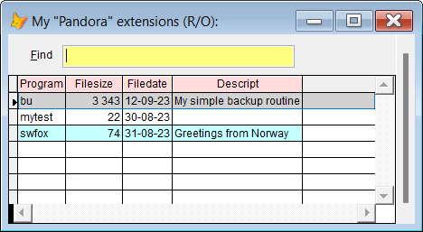
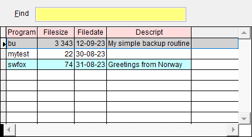

[](../README.md)

## Create your own `Sidekick` extensions

The key to using your own `Sidekick` extensions, is to remember the `!` symbol, aka exclamation mark. It's easy to remeber since "VFP uses ! as shortcut for **run**".  

All `Sidekick` extensions must be named `sk_xxx.prg` where `xxx` is the name of the tool.  

**Note:** In this documentation  is consistently used as this hotkey for `Sidekick`. It can easily be changed by using one of [Thor's](https://github.com/VFPX/Thor) tools. 

To create a tool, type `!xxx` and press . You are told that the file doesn't exist, and asked if you want to create it. If you confirm, the file is created in one of the following folders:

1. prog (if it exists)
1. prg (if it exists)
1. the default folder  

Write the code you want, and save it.

#### To "run" a `Sidekick` extension  

Type the same as mentioned above, `!xxx`, and press . **Sidekick** will locate the file and run it.  

#### To see a list of all your **Sidekick** extensions

| Command| Short                |        Result after pressing              |
|:---|:----------------------|:----------------------------------------------------------|
| sk | ! | Lists all your **Sidekick** extensions|

Select the one you want, and press **Enter** to run it.



If you know the name of the `Sidekick` extension:

| Command| Short                |        Result after pressing  |
|:---|:----------------------|:----------------------------------------------------------|
| sk xxx | ! xxx | `Sidekick` extensions sk_xxx is run|
| |!xxx |  Same as above, space not necessary with short version |

<a id="sked">

#### To modify or create a `Sidekick` extension:  </a>

| Command | Short                |        Result after pressing |
|:-------|:------------------|:----------------------------------------------------------|
| sked <sub>Note 1</sub> | !!    | Lists all **Sidekick** extensions|
| sked xxx <sub>Note 2</sub> | !! xxx |File `sk_xxx.prg` is opened in the editor |
| | !!xxx |Same as above <sub> |

Note 1: Select the one you want to edit, and press **Enter**.  
Note 2: If the named **Sidekick** extension means a non existent file, you get an error.  
Note 3: Space not necessary with short version  

  

### Sample Sidekick Extension

This program, sk_use.prg, will ease the work of opening a table. It works differently in the command window and in a code window.  

In the command window, type
```!Use yourtable``` and press . Now the table is used and selected.

In a code windows, do the same as above. The line is replaced with this:

```foxpro
Select (Select(JustStem("yourtable")))
Use ("yourtable")
```

This is the contents of sk_use.prg:

```foxpro
* Description: Sidekick tool to open a table *
* sk_use.prg 

Lparameters tcTable
Local lcCommand, llThor, lnWindowType, loEditorWin
m.llThor = Vartype(_Screen.cThorDispatcher) = [C]
If m.llThor
  m.loEditorWin = Execscript(_Screen.cThorDispatcher, [Thor_Proc_EditorWin])
  m.lnWindowType = m.loEditorWin.FindWindow()
  m.loEditorWin.Delete()
  If m.lnWindowType = 0 && Command window
    If !Empty(m.tcTable)
      Text To m.lcCommand Textmerge Noshow Pretext 3
        lnWorkArea = Select(JustStem("<<m.tcTable>>"))
        If m.lnWorkArea > 0
          Select (m.lnWorkArea)
        Else
          Select 0
          try
            Use ("<<m.tcTable>>")
          Catch
            messagebox( Textmerge('No table <<m.tcTable>> found'),48,'Warning!',5000)
          EndTry
        Endif
        If Upper(Alias()) = Upper(JustStem("<<m.tcTable>>"))
          Wait Window at 1,1 Textmerge('Table <<m.tcTable >> is opened') Timeout 3
        Endif
      Endtext
    Else
      m.lcCommand = 'Use'
    EndIf
    Execscript(m.lcCommand)
  Else
    If !Empty(m.tcTable)
      Text To m.lcCommand Textmerge Noshow Pretext 3
        Select (Select(JustStem("<<m.tcTable>>")))
        Use ("<<m.tcTable>>")
      Endtext
    Else
      m.lcCommand = 'Use'
    Endif

    m.loEditorWin.Insert(m.lcCommand + Chr(13))
  Endif
Endif
```
