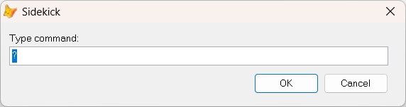

##  called from a blank line, or when the cursor is outside the Command Window or any of VFP's editors.

When your cursor is on a blank line, or none of VFP's editors is the active window, `Sidekick` behaves very differently. In a way this makes `Sidekick` behave more like a regular command line utility.   
From here, by pressing  you get an inputbox where you can type most of `Sidekick's` "commands".

As you see from the picture, the default text is a question mark, ?.  
* If you only press `Enter`, you will see `Sidekick's` list of commands. Select one, and press `Enter`.
* Or you can type a `Sidekick` command followed by `Enter`.

A highly appreciated "hidden secret" of this command window, is that you can type almost all VFP commands in this inputbox. For instance if your application hangs, you can type `Cancel`, `Suspend` or `Clear events`. 

NB! You get no guarantee that the result is always what you hope for. :grin:

Note that some `Sidekick` commands writes back to the Command Window or to the active code editor. These commands can **not** be called from this inputbox or the menu it calls. They must be called directly from where you want the generated text written.

**Note:** In this documentation  is consistently used as the hotkey for `Sidekick`. It can easily be changed by using one of [Thor's](https://github.com/VFPX/Thor) tools. 
