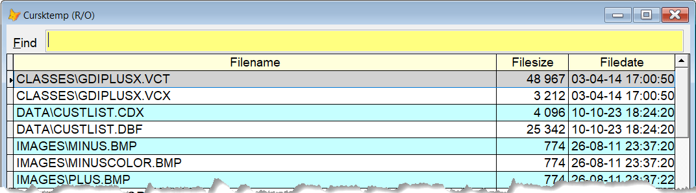

## `FF` (Find Files)

As the name implies, this command is used to find files on your system.  

Easy to use: type `ff xxx` and press .  
`xxx` can be the name of the wanted file, or you can use the standard Windows wild cards, `?` and `*`. 

All the folders below the current folder, curdir(), will be searched.  

This is what I see on my machine with the command `ff *us*.*`:

Select the file you want, and confirm that you want the filename, including its path, copied to the clipboard. 

To avoid the confirmation mentioned, you can add the command line switch `/Y`, or use the alternative command `FFY`.

**Note** This tool is still in development, check here for updates.

