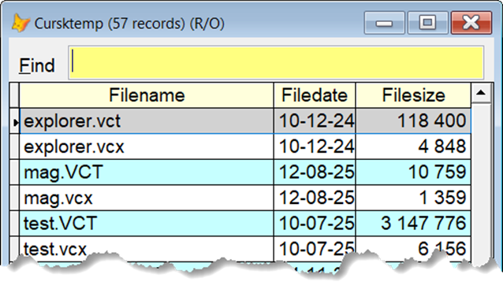

## `FL` (File Lister)

A super quick file lister with no "bells and whistles".  

It will list all the matching files in the current folder and path.  

Unlike DR and its variants, the files are sorted alphabetically within each folder, and the folders are listed in the order they are specified.  

It takes only one optional parameter, the wanted file extension. With no parameter, the default, `prg`, is assumed.  

You can also use the wild card characters `*` and `?`, alone or in combination with one or more characters. 

Note that nothing happens with the files, this is a "display only" tool.

This what I see on my machine with the command `FL vc*`:

