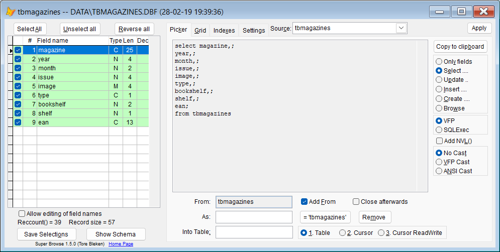

## `FP` (Field Picker)

### Open SuperBrowse as a field picker for SQL statements.  

**Note:** In this documentation  is consistently used as the hotkey for `Sidekick`. It can easily be changed by using one of [Thor's](https://github.com/VFPX/Thor) tools. 

| You type:                |        Result after pressing |
|:-------------------------|:----------------------------------------------------------|
| `Fp` | SuperBrowse opens the currently selected table or cursor |
| `FP xxx` | SuperBrowse opens with the named table or cursor |  

Select the fields and options you need, and press `Apply`. 

