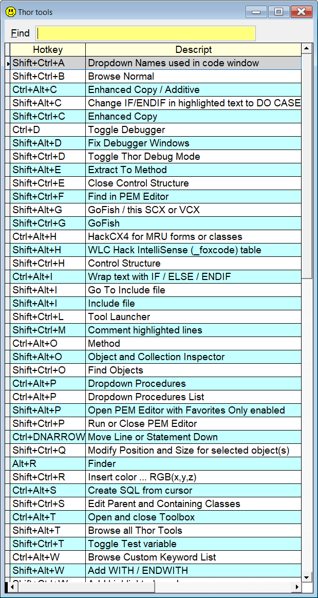

## `HK` (HotKeys)

### List all your assigned hotkeys, with incremental search

**Note:** In this documentation  is consistently used as the hotkey for `Sidekick`. It can easily be changed by using one of [Thor's](https://github.com/VFPX/Thor) tools. 

| You type:                |        Result after pressing |
|:-------------------------|:----------------------------------------------------------|
| `hotkeys` | A picklist of all your assigned hotkeys |
| `hk`    | Same as above|  

Locate the wanted tool by using the up/down keys, or type parts of the description.  
Press **Enter** to run the selected tool  

