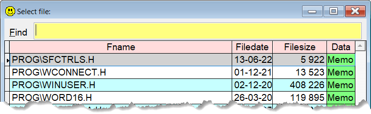

## `INC` (or `#`) (INClude)

This keyword is a helper to include header files, .h, into your program. Type `inc` or `#` and press `F8`, and you get a dropdown list of all the .h files in your path.

**Note:** In this documentation  is consistently used as the hotkey for `Sidekick`. It can easily be changed by using one of [Thor's](https://github.com/VFPX/Thor) tools. 

| You type:  | After pressing |
|:----------|:----------------------------------------------------------------------|
| `inc` | Picklist of all .h files in your path |
| `inc w` | Picklist of files matching \*w\*.h in your path |
| `# w` | Same as above, \# and inc are interchangeable   |

The result after pressing `Enter` is `#include yourfile.h`

