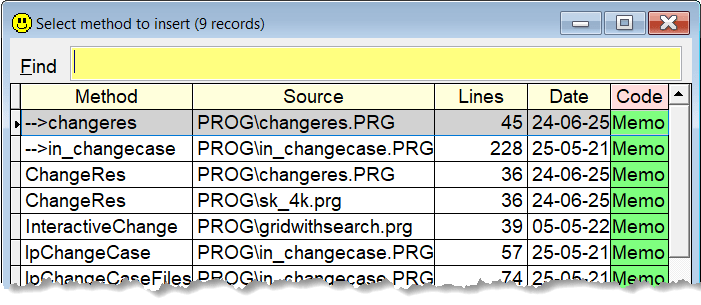

## `INS` (or `+`) (INSert) 

### Insert the code from another prg 

Often you want to insert the code from another prg into the active file. Typically this is a small code snippet or a function. Or it can be a header file, or even a complete prg file.  

With `Sidekick` this is extremely simple.

**Note:** In this documentation  is consistently used as the hotkey for `Sidekick`. It can easily be changed by using one of [Thor's](https://github.com/VFPX/Thor) tools. 

| Command | Result after pressing |
|:----------|:--------------------|
| `ins` | A list of all procedures in all the prgs in the path  |
| `+` | Same as above |
| `+xxx` | Same as above, only procedures with xxx in its name|
| `ins xxx.prg`|The whole contents of xxx.prg is inserted|
| `+ xxx.prg` | Same as above'
| `+xxx.h`  | The complete contents of xxx.h is inserted |

If you don't specify any file extension, you can hover the mouse over the green cells, and see what will be inserted. Pick the function you want, and press `Enter`; or `Escape` to cancel.

***Note:*** This function only works in VFP's code editors.
