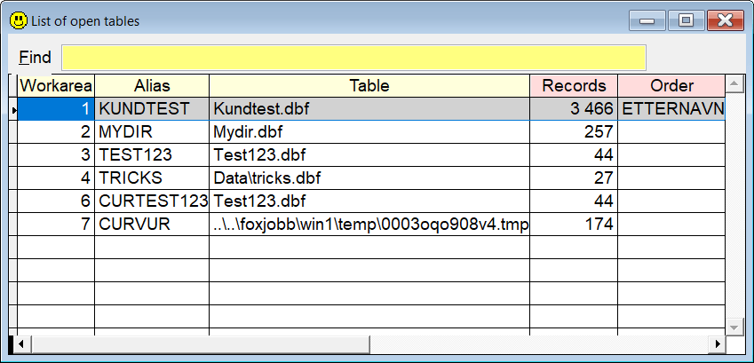

## `LO` (List Open Tables)

`LO` shows all the open tables and cursors in the current datasession in a grid, in addition to their alias, table name, record count and order. If you select one and press `Enter`, the corresponding work area is selected.

| You type:                |        Result after pressing  |
|:-------------------------|:----------------------------------------------------------|
| `lo`                       | The list of open tables and cursors is presented.  |

**Note:** In this documentation  is consistently used as the hotkey for `Sidekick`. It can easily be changed by using one of [Thor's](https://github.com/VFPX/Thor) tools. 

