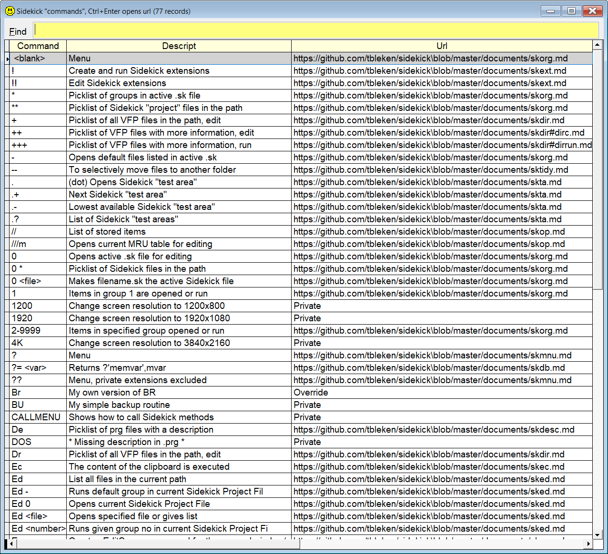

## `Menu` (or `?`)

This "command" shows a list of all the `Sidekick` tools that are relevant from where in the IDE you are. 

| You type:                |        Result after pressing  |
|:-------------------------|:----------------------------------------------------------|
| `menu`                       | A list of all relevant `Sidekick` commands is shown.  |
| `?` | Same as above |  
  

Select the option you want, and press `Enter`.  

Some commands have necessary or optional parameters. For these commands, an inputbox will open so that you can type them in, and press `Enter`.

**Important**: The `Sidekick` commands that "write back" to the command window or one of VFP's code editors, can not be called from this menu! They require that the code window in question is the active one when you press .  

The actual menu you will, see depends on where in the IDE you are.

**Note:** In this documentation  is consistently used as the hotkey for `Sidekick`. It can easily be changed by using one of [Thor's](https://github.com/VFPX/Thor) tools.