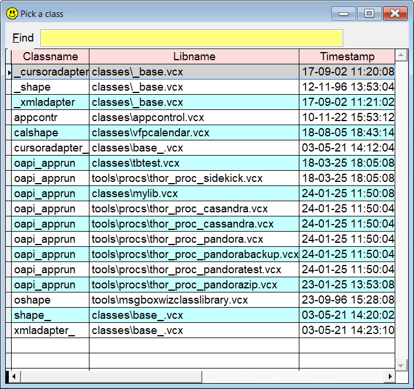

[](../README.md)

## `NO` (NewObject builder)  

`NO` is short for NewObject, and is a helper to locate the wanted class and create the correct syntax. Also the corresponding Local declaration is added in code windows.    
The syntax is best shown by samples. Pressing `F8` will present a dropdown of matching candidates. 

If the given class name is not unique, a list of all "candidates" are listed. Select the one you want, and press `Enter` to complete the process. Press `Esc` to abort.

If there is only one match, no list is shown.  

**Note:** In this documentation  is consistently used as the hotkey for `Sidekick`. It can easily be changed by using one of [Thor's](https://github.com/VFPX/Thor) tools. 

This is what happens in a prg or a method code window:

| You type:  | After pressing  and having select the wanted class:|
|:----------|:--------------------------------------------------------------------------------------|
| `no loVar my`  | `Local loVar as my of mylib.vcx` </br>`loVar = NewObject('my', 'mylib.vcx')`|
| `no lo` | All classes are listed, variable is `lo` |
| `no my*` | All classes matching `*my*` are listed, variable is `lo` + class name |
| `no *my` | Same as above | 
| `no lo my` | Same as above, variable is `lo` || `no *` | Same as above, **all** clases are listed, variable is `lo` + class name |
| `no` | Same as above, variable is `lo` |

All the samples will also work in the Command window, except **no** Local declaration is added.  

In order to be compatible with Thor's "old" `no` dynamic snippet, also the following syntax variations are accepted, but no longer recommended:  

| You type:  | After pressing  and having select the wanted class:|
|:----------|:--------------------------------------------------------------------------------------|
| `no loX gr` | All classes matching `*gr*` are listed, variable is `loX` + class name
| `lomy = no my` | Classes matching `*my*` are listed, variable is `loMy` |
| `no loMy my` | Same as above |
| `no loMy= my` | Same as above|
| `no loMy=my` | Same as above|


Possible command line switches:  
* `/n` (`Newest first`): For identically named classes, show the newest first. 
* `/-n`: Opposite of `/n`. If "newest first" is default, this switch force will alphabetical order for the current operation.

`/n` (`Newest first`) is the default behavior. You can change this in [Sidekick options](skconfig.md).   

This is what shows on my machine when I use this "command": `no *ap /n`. Note the `/n` which puts the newest classes first.  

!

And this is what ends up in my editor window when I select the first `oapi_apprun` class from one of VFP's code editors:  
```foxpro
Local loAp as oapi_apprun of classes\tbtest.vcx
loAp = NewObject('oapi_apprun', 'classes\tbtest.vcx')
```
And if I do the same from the Command window:
```foxpro
loAp = NewObject('oapi_apprun', 'classes\tbtest.vcx')
```
