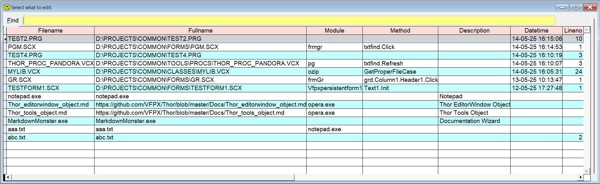

## `OP` (or `//`) (Open files)

### An easy way to work with your most frequently modified files and modules.  

To get quick access to your "favorite places", `Sidekick` uses a table, default name is `SKMRUList.dbf`. You can easily add and remove entries, and show a picklist. 

| You type:                |        Result after pressing           |
|:-------------------------|:----------------------------------------------------------|
| `op+`     | The necessary data to re-open the code window is stored |
| `op-`  | The record for the active code window is hidden by setting Active to .F. |
| `op`  | You get a picklist of earlier `active` entries in the table | 
| `//` | Same as above |
| `op*` | Same as above |
| `op?` | Same as above |
| `op init`  | Same as above, only entries with `init` in any of the listed fielda are shown  |
| `op .prg`  | Same as above, only .prg files are shown  |
| `op .vcx`  | Same as above, only .vcx files are shown  |
| `op /a` | Shows all records, also where Active = .F. |
| `op /e` | Shows only records where External = .T. |
| `op /m` | Browse the defined table, default is `SKMRUList.dbf`. **Note:** no error checking! |   

The "commands" `op` and `//` are interchangeable. 

Note that if you specify a file extension, the filter for `external only` is ignored.  
If only one record matches, the file is opened immediately.
   

`op+` will add a new record if it's not already there. The datetime field will be updated, and the Active field will be set to .T.  
The procedure is very simple: You open any editor (not the command window), type `op+` (or `//+`) and press . This will add the necessary data to re-open the same item on the same line. If necessary a new record will be created. 

`op-` will set the active field to .F. which will effectively hide it from the list. Also the datetime field will be updated. The procedure is exactly the same as for `op+`; type `op-` (or `//-`) in an editor, and press .  

`op` or `//` Will list all the entries in the table, except the inactive records. Note that the list is sorted on the datetime field, in descending order.

**Technical:** This utility is based on a table, `SkMRUList.dbf` by default. The name of this table can be changed, see value `MRU table for OP command` in [Sidekick options](skconfig.md).  

This table has the following fields:  

| Name | Type | Description  |  
|:-----|:-----|:-------------|  
| Fullname | c(240) | Full path to the file in question |
| Module   | c(100) | Name of class, module or program to open the file |
| Method   | c(40)  | Name of method (in .vcx or .scx) |
| Lineno   | int    | Line number in method or .prg |
| Descript | c(40)  | Description |
| Datetime | T      | Date and time for last "update" (see `op+` above) |
| Active   | L      | .F. will hide the record, unless command `op? /a` is used |
| External | L      | .T. means a "no-VFP" file |  

For "external" "files", these rules apply:
* To run external programs, the name of the executable file goes into `Fullname`
* If the external program needs parameters, the name goes into `module` and the parameters goes into `fullname`
* URL's or data files goes into `fullname` if you want Windows' default programs to open them.    

Here are a few samples of what goes where in `SkMRUList.dbf`:  

| Fullname | Module | Method | Line | Ext | Note |
|:---------|:-------|:-------|-----:|:--|:-----| 
| d:\my\my.prg |    |        | 10   |.F.||
| d:\my\my.vcx | myclass | init | 5 |.F. ||
| d:\my\my.scx | myform | Header1.Click | 15 |.F.||
| Notepad.exe  ||||.T.||
| mytext.txt | ||10|.F.| Modify File |
| mytext.txt | Notepad.exe||| .T.| Notepad is specified|
| https://mysite.com/page1 ||||.T.| Default browser |
| https://mysite.com/page1 | opera.exe |||.T.| Specific browser |

**Note:** In this documentation  is consistently used as the hotkey for `Sidekick`. It can easily be changed by using one of [Thor's](https://github.com/VFPX/Thor) tools.

For more tips on this feature, check [Your "busy files" list `Sidekick.sk`](skorg.md)