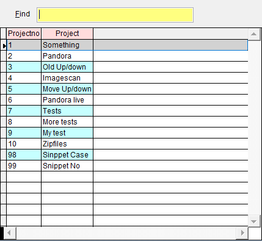
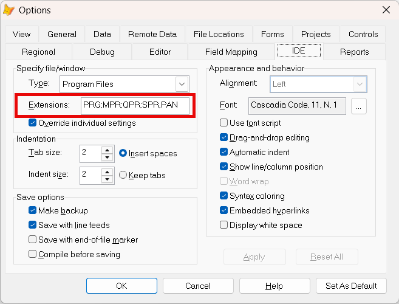

Introducing `Sidekick` "group of files organizer"

`Sidekick` is a utility that helps VFP developers manage, use, and execute files, classes, objects, code, as well as offering additional development productivity features more.**

**Note:** In this documentation  is consistently used as this hotkey for `Sidekick`. It can easily be changed by using one of [Thor's](https://github.com/VFPX/Thor) tools. 

--------------------------------

<a id="Sidekick_sk" > 

## 1. Your "busy files" list `Sidekick.sk` </a>

To really take advantage of `Sidekick`, It's recommended to have a file called `Sidekick.sk` in your working folder. It can have other names, but in this document this file is consistently called `Sidekick.sk`. 

Note that you can have several `.sk` files, but only one can be active at the time. 

If the file `Sidekick.sk` doesn't exist, it can be created in three ways:
1. In the Command window, press   in a blank line, and confirm.
2. In the Command window or any VFP editor window, type 0 (zero) on a blank line, press  and confirm.
3. Create the file using any editor, e.g. Modify File or Notepad.

Here is the content of a typical `Sidekick.sk`:

> Default project: 5
> ****************************************
> 0 exe do my setup.prg && Sets up the environment  
> 0 startup.prg  && Needed in every project  
> 0 myheader.h  && Needed in every project  
>
> #1 My new tool  
> 1 MyNewTool.prg && This may become a cool program  
> 1 https://github.com/VFPX/Thor  
>
> #2 My new Thor tool  
> 2 (_screen.cthorfolder + 'Tools\My Tools\Thor_Tool_MyNewTool.prg')  
> 2 Sidekick.sk && This file  
> 2 mynotes.prg  
> 2 testing.prg  
> 2 SetDate()  
> 2 Do Mystart with 'SomeValue'  
> *2 (Home(0) + 'foxpro.h') && Header file, don't need it for now 
> 
> #3 My next project, not started yet  
> 3 Some.prg  
> 3 https://github.com/VFPX/Thor  
> 3 (Home(0) + 'foxpro.h') && Header file  
> 3 test.prg  
> 3 exe On Key Label ALT+2 do test
>  
> #4 My test environment  
> 4 test2.prg && Needs testing  
> 4 D:\Projects\common\prog\PROCESSTEXT.PRG  
>
> #5 Zip utility, needs more classes, and must be tested  
> 5 utilities.vcx.zipfiles.zipfile:2  

To open **all** the files prefixed with a number, type that number in the Command window and press `F8`. This may be any kind of file as seen in the previous paragraphs. Typically these will be a group of related files that you work with in a VFP project, also non VFP files.

A special case in many aspects is `0 (zero)`: 
1. `0` in the Command window will open `Sidekick.sk` for editing, if it exists.
2. `0` as the group number in `Sidekick.sk` will include the file(s) mentioned for every group.

Notice the first line above, `Default project: 5`. To open all the files in the specified group, `5` in this example, you don't have to specify the number. Just press  in an empty line in the Command window, and all the #5 files will be opened, plus all the #0 files. Notice that this number must be the very last "word" in the first line.

Tip: If you store this file in your applications' root folder, you can have different versions in each of them.

## Note on the ***Sidekick*** keyword `exe:`  

If you want to **run** a prg or execute a VFP command or any .prg file from `Sidekick.sk`, you must include the keyword `exe`.  
You can see this "in action" above with the line `3 exe On Key Label ALT+2 do test`. The result is that when you type `3` in the command window and press , this line will be `executed` while the other files starting with `3` are opened in the editor. 

#### NB! The keyword `exe` can be changed in [Sidekick_override.h](skconfig.md)!

## Note on the ***Sidekick*** keyword `ed`

Note that in the `Sidekick` "organizer" file `Sidekick.sk`, the keyword `ed` must be left out if a group number is included as the first character(s) a line.

### Using `Sidekick.sk`: 

|C/E| You type:                |        Result after pressing         |
|--|:-------------------------|:----------------------------------------------------------|
| C| `ed`                           | Group of files defined in line 1 of `Sidekick.sk` are opened |
| C| `<blank>`                    | Same as above                                             |
| C| `ed x (x=integer,>0)`          | Group of matching files in `Sidekick.sk` are opened       |
| C| `x (x=integer)`                | Same as above                           |
|CE| `ed 0 (zero)`                  | File `Sidekick.sk` is opened in editor   |
|CE| `0`                            | Same as above                             |
|C| `es 1-999`               | Creates Editsource() command for all open windows   |
| C| `pr` or  `-` (hyphen/minus)             | Picklist of projects in active `.sk` file (default = `Sidekick.sk`) |
| C| `0 somefilename`             | Active `Sidekick` file is changed to `somefilename.sk`       |
| C| `0 *`                 | Picklist of `Sidekick` files in the path  |
| C| `0 ?`                 | Active `Sidekick` file is reported  |

#### The C/E column describes where the "command" (keyword) works: 
**C:** Command Window  
**E:** program editor (Modify Command) and the text editor (Modify File) 

## 2. Easy opening (or running) VFP files  

| You type:                |        Result after pressing |
|:-------------------------|:----------------------------------------------------------|
| `ed test.txt`                  | File `test.txt` is opened in editor        |
| `ed prog\pro1.prg`             | `prog\pro1.prg` is opened in editor              |
| `ed (_screen.cthorfolder + 'Tools\peme_snippet_no.prg')` | variable is resolved and file opened in editor |
| `ed myprog.prg && My notes`    | `myprog.prg` is opened, comments ignored       |
| `ed mytable.dbf`               | `mytable.dbf` is opened in SuperBrowse        |   
| `ed pg.vcx`                    | `pg.vcx` is opened in the Class Browser  |

#### This feature works in the Command Window and in the editors (Modify Command and Modify File): 

`ed` followed by a the name of a file, will open that file. 

| File extension | Files will open in: |  
|:-------------------------|:----------------------------------------------------------|
| prg| Editor  |  
| txt|Editor  |
| pan| Editor |
| dbf| SuperBrowse  |
| scx| Form Designer|
| vcx| Class Browser|
| frx| Report Designer|
| lbx| Label Designer  |

### 2a. Opening Forms and Class Libraries: 

For a scx or vcx where the name of the method is specified, with or without the optional line number, the class is opened, and the specified method is opened in the editor.  
Likewise, for a vcx the class browser is opened, in addition to the method editor.

| You type:                |        Result after pressing `F8`                                |
|:-------------------------|:----------------------------------------------------------|
| `ed pg.vcx.pg1`      | Class `pg1` in `pg.vcx` is opened, last method appears in the editor|
| `ed pg.vcx.pg1.init` | Class `pg1` in `pg.vcx` is opened, `init` method appears in the editor|
| `ed pg.scx.form.txtfind.keypress`  | Form `pg.scx` is opened and editor shows `form.txtfind.keypress`|
| `ed pg.scx.form.txtfind.keypress:10`| Same as above, cursor is on line 10         |

#### This feature works in the Command Window and in the editors (Modify Command and Modify File) 

***Tip:*** You can store your frequently used commands in `Sidekick.prg` or in any other .prg!

## 3. Opening external files:  

For registered file types, the file will be opened in the corresponding application.  
Likewise, a URL will be opened in the default Browser.

| You type:                |        Result after pressing              |
|:-------------------------|:----------------------------------------------------------|
| `ed https:\\github.com/VFPX/Thor` | Thor homepage opens in default browser      |
| `ed C:\Somefolder\Somefile.xlsx`    | `Somefile.xlsx` is opened in Excel        |
| `ed C:\Somefolder\Somemovie.mp4`    | `Somemovie.mp4` is opened in default application        |

#### This feature works in the Command Window and in the editors (Modify Command and Modify File) 

<a id="proj">

## 4. List of active "projects" or "group of files"  </a>

| Command| Short                |        Result after pressing |
|:-------|:------------------|:----------------------------------------------------------|
| `project`| `pr`, `-` (minus) | List of "projects" in the active .sk file|

  

## Tip: If you add `.sk` as a `Program Files` extension in VFP's options menu, you will be able to take advantage of IntelliSense in your `Sidekick` "projects".

