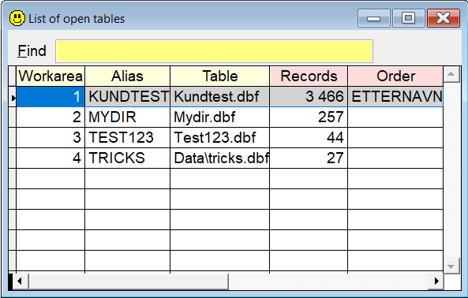

## `OT` (Open Tables)

`OT` is an easy way to see all the open tables and cursors in the current datasession in a grid, in addition to their alias, table name, record count and order. 

| You type:                |        Result after pressing  |
|:-------------------------|:----------------------------------------------------------|
| `ot`                       | A list of all open tables and cursors active data session.  |

Select the wanted alias/work area to select it by pressing `Enter`. 
Press `Esc` to report the currently selected alias/work area.

**Note:** In this documentation  is consistently used as the hotkey for `Sidekick`. It can easily be changed by using one of [Thor's](https://github.com/VFPX/Thor) tools. 

