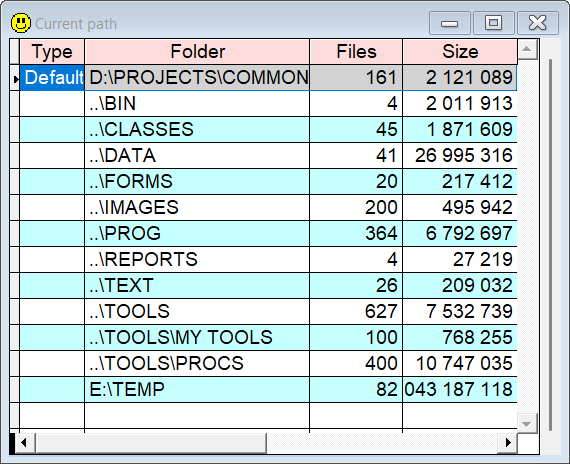

## `PA` (Path)

`PA` is an alternative to Set('Path') which shows the active path in a grid, in addition to the number of files and the total file size in each folder.

| You type:                |        Result after pressing  |
|:-------------------------|:----------------------------------------------------------|
| `pa`                       | The list of folders in the currently active path.  |

**Note:** In this documentation  is consistently used as the hotkey for `Sidekick`. It can easily be changed by using one of [Thor's](https://github.com/VFPX/Thor) tools. 

