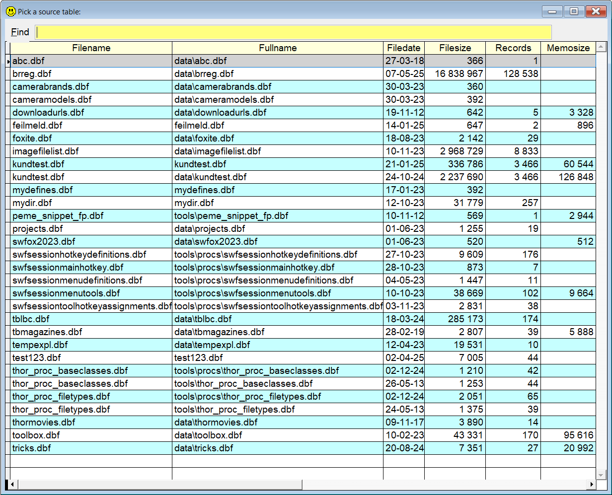

## `SF` (Select From builder)

### An easier way to create the correct `Select ... From` syntax

**Note:** In this documentation  is consistently used as the hotkey for `Sidekick`. It can easily be changed by using one of [Thor's](https://github.com/VFPX/Thor) tools. 

This utility lets you type `sf` and press . This will show a form with a grid containing all the .dbf's in your path.   

Select one, and code similar to `Select | from yourtable` is created for you. 

The cursor is positioned at the `|` (vertical bar). Press `.` (dot) and a list of all the fields in the selected table appears, ready to be picked from.  

| You type:                |        Result after pressing  |
|:-------------------------|:----------------------------------------------------------|
| `sf`                       | A list of all DBF's in the path is shown.  |
| `sf ab`                    | All DBF's with `ab` in the name is listed    |

If only one table matches the specified text, no list appears, and the table is selected.
 

