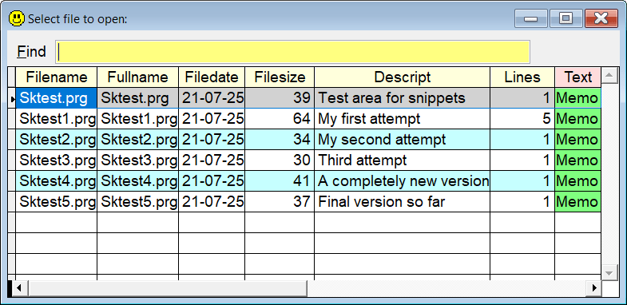

## `TA` (or `.`) (Test Area)

### Your easy accessible testing area(s) 

During your work with VFP you often need a "place" to test code snippets, a module or a bigger part of your application. For this kind of work, most programmers create a number of `temp1.prg`, `temp2.prg` or `test1.prg`, `test2.prg` and so on.  

`SideKick's` `TA` utility can help you organize these temporary files.  

`TA` works with one or several files, default name being `SKTestxxx.prg` where `xxx` represents variants. The default name can be changed in Thor's Options page, see [skconfig.md](skconfig.md) for details.   

For this documentation the default name, `SKTest.prg`, is used.

`SKTest.prg` is initially an empty file, except for a `Description` template which makes it easier to find the table later. It's recommended to type a meaningful description!  

 

| You type:                |        Result after pressing `F8`                                |
|:-------------------------|:----------------------------------------------------------|
| `Ta`                  | Opens `SKTest.prg`  |
| `Test`                  | Same as above  |
| `. (dot)`                  | Same as above  |
| `, (comma)`                | Same as above                              |
| `Ta 1`               | Opens `SKTest1.prg` |
| `.1`           | Same as above |
| `. 1` | Same as above|
| `.MyTest` | Opens `SKTest_MyTest.prg`, note the added underscore|
| `.?` | List of all files matching `SKTest*.prg` |
| `. ?` | Same as above |
| `ta.` | Same as above |
| `..` | Same as above |
| `,,` | Same as above |
| `ta+`| Will suggest the "next" test area.  |
| `ta-`| Will suggest the lowest "available" test area.  |

`ta+` (and the variants) will look for files matching `SKtest*.prg` where `*` represent numbers, and suggest the highest `*` + 1. IOW, if the "highest" file name it finds is `SKtest5.prg`, `SKtest6.prg` will be suggested.  
Likewise, `ta-` will look for gaps in the files matching `SKtest*.prg`, and suggest the lowest unused filename. 

In short, every command variation for `ta` also works for `test`, `. (dot)` and `, (comma)`.  And space between this keyword and the `parameter` is optional.

**Note 1:** As mentioned above, the default name for this utility can be changed in Thor's Options page, see [skconfig.md](skconfig.md) for details.  

**Note 2:** In this documentation  is consistently used as the hotkey for `Sidekick`. It can easily be changed by using one of [Thor's](https://github.com/VFPX/Thor) tools.