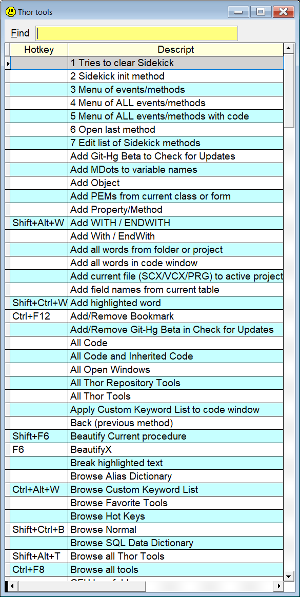

## `TH` (`Thor` or `Tools`) (THor tools)

### List all registered Thor tools, with incremental search 

**Note:** In this documentation  is consistently used as this hotkey for `Sidekick`. It can easily be changed by using one of [Thor's](https://github.com/VFPX/Thor) tools. 

| You type:                |        Result after pressing |
|:-------------------------|:----------------------------------------------------------|
| `thor` | Lists all Thor tools unstalled on your machine|
| `th` | Same as above |
| `tools` | Same as above |
| `thor xxx` | Same as above, description or program name contains `xxx` |
| `th xxx` | Same as above |
| `tools xxx` | Same as above |
| `thor xxx yyy` | Same as above, description or program name contains both `xxx` and `yyy` |

The list has incremental search to narrow the selection. Pick the wanted tool, and press **Enter** to run it. 

**Note:** some tools may not be relevant from where you are in the IDE, in which case the tool won't start, or you will get a warning or an error.

