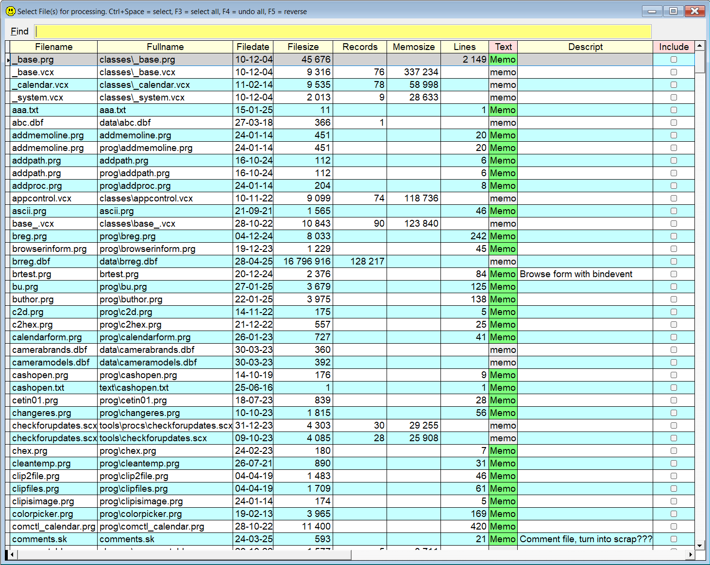

## `TIDY` (or `--`) 

**Note:** In this documentation  is consistently used as the hotkey for `Sidekick`. It can easily be changed by using one of [Thor's](https://github.com/VFPX/Thor) tools. 

Tidy shares much of the code and functionality with [`Zip`](skzip.md), but instead of zipping the file(s), they are moved to a separate folder. Unless specified, this folder is called `BU`, short for BackUp.

The idea is that from time to time, you want to get rid of files, or at least move them to a secondary folder. For a really thorough cleanup, type the following in your command window:  

Type `tidy`, or the shorter version `--`, and press .  

Now you will see a form with a grid. All the files in your active VFP path will be listed. You can reduce the selection by typing text, which can be in the files' names or in their content. 

Scroll to the files you want to move, and press `Ctrl+space` to include the files you want, `F3` select all and `F4` to undo all. `F5` "reverses" the selection.  

If you want to inspect the content of the files, hover your mouse over the green cells. 

When you press `Enter`, you are asked to confirm that the marked files are moved to another folder, as explained below. If no files are marked, only the currently selected file will be moved.

You can also specify which file you want to move directly, and optionally a target folder of your choice.

**Note:** This feature will also move both the "primary related files (`prf`)" and the "secondary related files (`srf`)". A `prf` is vital for using the file, while a `srf` is typically used for backup or for version control systems.  For a `.dbf`, the `prf` means `.cdx` and `.fpt`, while `srf` means `.db2`. A `.prg` has no `prf`, while both `.err` and `.fxp` are `srf`.

| You type:                |        Result after pressing  |
|:-------------------------|:----------------------------------------------------------|
| `Tidy` | You see a form with all the files in all the folders in VFP's path |
| `--` | Same as above. Selected files are moved to the default folder, `BUxxxxxx` |
| `-- ?` | Same above , `?` is default |
| `-- ? myfolder` | Same as above, target folder is `myfolder` |
| `Tidy yournote.txt  backup` | `yournote.txt` is moved to the folder `backup` |
| `-- yournote.txt  backup` | same as above |
| `-- yournote.txt` | `yournote.txt`is moved to `Sidekick's` default folder `BUxxxxxx` |
| `-- yourfile.dbf zz` | `yourfile.dbf` and the corresponding `.cdx`, `.fpt` and `db2` are moved to `zz`|
| `-- yourfile.txt zz?` | `yourfile.txt` is moved to `zzYYMMDD` (for instance `zz250303)` |

**Note:** `xxxxxx` means the current date in the format `YYMMDD`. IOW, `BUxxxxxx` can mean for instance `BU250303`. This string is automatically added to the name of the destination folder, when the given name ends with a question mark, `?`. `Sidekick's` default destination folder for the `Tidy` function is `BU?`.  

Also note that [`zip`](skzip.md) with the `/d` option is similar. Instead of moving the files to another folder, they are "moved" into a zip file. However, in contrast to `tidy`, `zip /d` does **not** move the corresponding `srf`. Samples of these files are `.bak`, `.fxp`, `.err`, `.db2` and a few more.  

Possible options:  
`/a` (for **all**): Will give much more information in the grid. The picture below is with this command switch.

