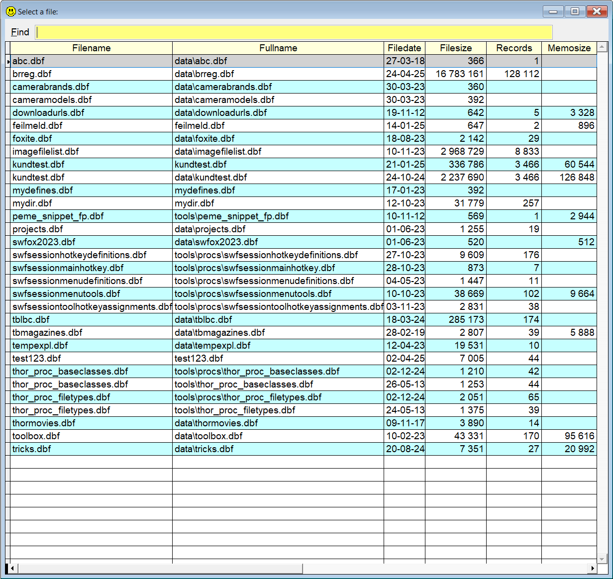
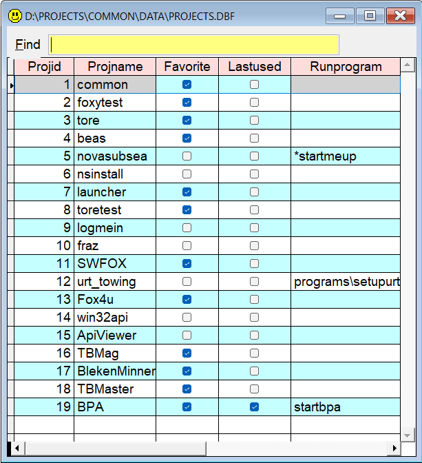
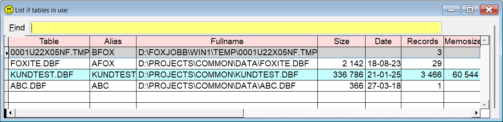
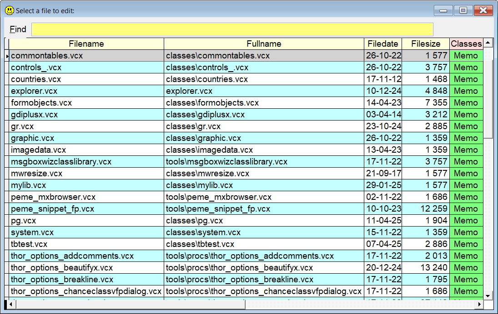
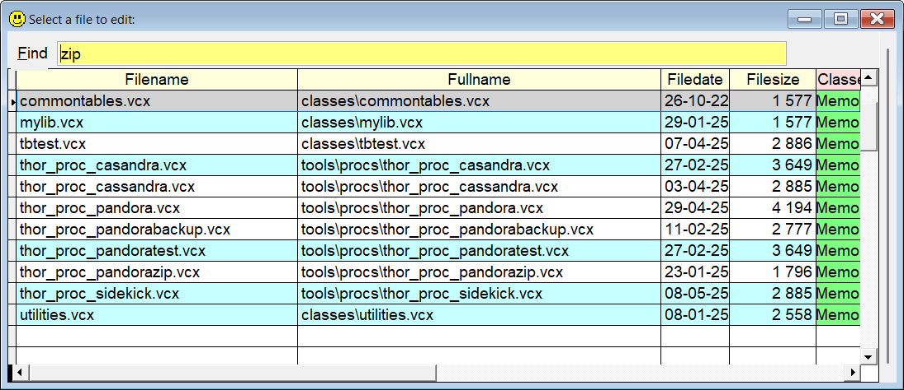
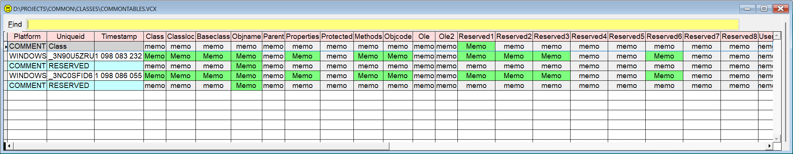
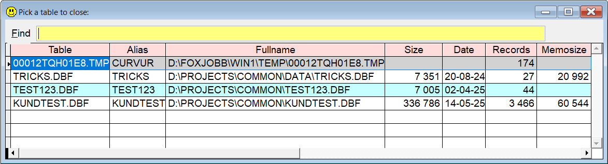

[](../README.md)

## `US` (USe syntax builder)

### An easier way to locate tables, and create the correct syntax to open them.

**Note:** In this documentation  is consistently used as the hotkey for `Sidekick`. It can easily be changed by using one of [Thor's](https://github.com/VFPX/Thor) tools. 

This utility lets you type `us` and press . This will show a form with a grid containing all the .dbf's in your path. 
* In the command window: Select the one you want, press Enter, and the table is used in a new work area and selected. If the table was already used, the given work area is selected.  
* In any of VFP's program editors (Modify Command or a method window), the necessary code to use the selected table is inserted.
* You can narrow the number of "candidates" by typing a part of the table name after `ed`.


| You type:  | After pressing : |
|:----------|:--------------------------------------------------------------------------------------|
| `us`  | A form similar to the image appears|
| `us sw` | Same as above, only tables with `sw` somewhere in the name or path appear |
| `us sw sess`  | Same as above, only tables with **both** `sw` and `sess` somewhere in the name or path appear|

  

When done from one of VFP's code editors, code like this will be inserted when you press `Enter`:

```foxpro
Use data\projects.dbf in Select("projects")
```

And if you do the same from the Command Window, the chosen table is selected and will appear in a modal form with a grid and searching facilities. 



Also in the command window, the typed "command" is replaced with something like this, as a reminder:

```foxpro
* Select Select(projects )
* Use data\projects.dbf
```

**NB!** If you don't want to see the modal form with the grid, you can add the switch `/-b`, like `us my /-b`. Or you change it permanently in `Sidekick Options` in `Thor Tools -> Options`.

Note that with this change in behavior, you can still get the grid by using the `/b` switch, like `us my /b`.  

The different path options are also defined in Sidekick Options (Thor Tools -> Options). However, this setting can be temporarily overridden:
* `us /f` means full path, fullpath(filename) is used.
* `us /j` means no path, justpath(filename) is used.
* `us /r` means relative path, sys(2014(filename)) is used.

If you want to generate code to both use a table and select it, you have two alternative variants.   
* `us /y my` 
* `uss my`

If you pick the table DATA\MyTable.DBF, both of these commands will generate this code in VFP's editors:

```foxpro
Select Select("MyTable")
Use "DATA\Mytable.DBF"
```


<a id="skselopen">  

### Select an open table 

If you want to **Select** an already used table, you can use this variation to get a list to pick from:

| You type:  | After pressing : |
|:----------|:--------------------------------------------------------------------------------------|
| `us -`  | Only tables and cursors already in use are shown|
| `us /u`| Same as above |  

**NB!** Note that this "command" selects the table, it doesn't produce any code in any of VFP's code editors.
   


### Inspect a .vcx  

If you want to **use** a vcx for inspecting it, `Sidekick` has a special version of `us`.

| You type:  | After pressing : |
|:----------|:--------------------------------------------------------------------------------------|
| `us .vcx`  | All .vcx class libraries are listed|
| `us .v`| Same as above |

  

This makes it possible to easily find the specific class you want. Since all the classes are in the Classes memo fields, they are also included in the Find filtering process. This shows the same form with `zip` typed in the Find textbox:



And this shows the form after the first record is selected:




<a id="skclose">  

### Close an open table 

If you want to close a table which is in use, you can use one of these commands:

| You type:  | After pressing : |
|:----------|:--------------------------------------------------------------------------------------|
| `cl`  | Only tables and cursors already in use are shown|
| `us /c`| Same as above |  



**NB!** Note that this "command" closes the table, it doesn't produce any code in any of VFP's code editors.

