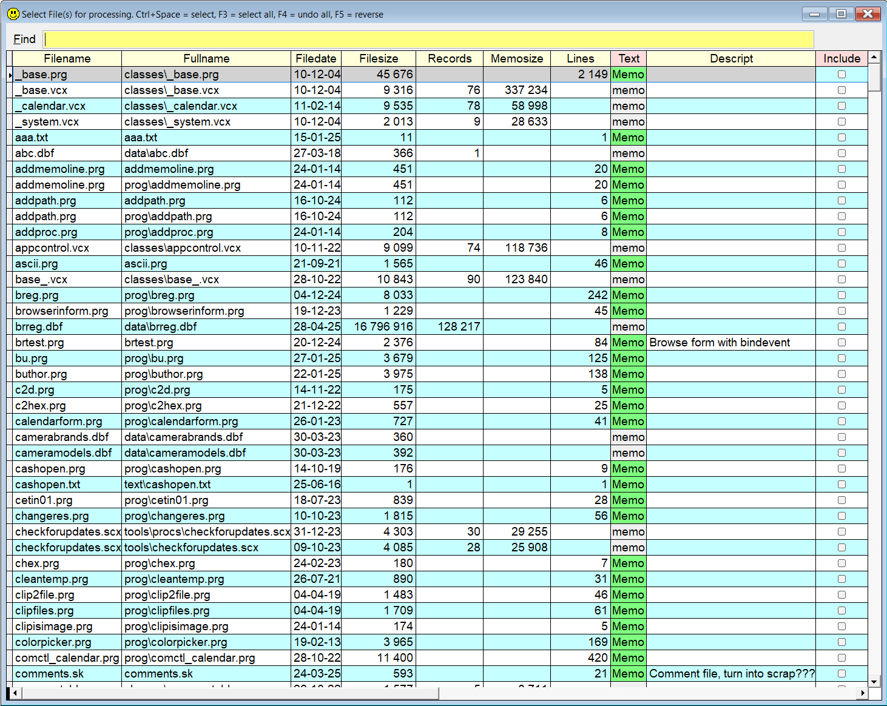
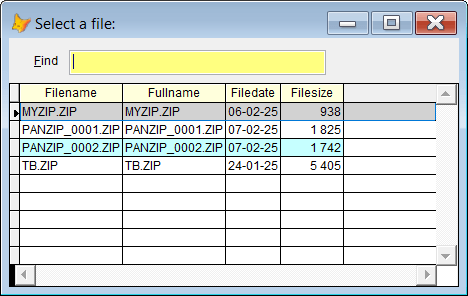

## `Zip`

Now you can zip and [unzip](#unzip) files directly from VFP!  

**Note:** In this documentation  is consistently used as this hotkey for `Sidekick`. It can easily be changed by using one of [Thor's](https://github.com/VFPX/Thor) tools. 

### `Zip`

Sidekick's zip and unzip features are based on [VFPXZip](https://github.com/VFPX/VFPXFramework/blob/main/Doc/Documentation.md) which is a part of the [VFPX Framework](https://github.com/VFPX/VFPXFramework/blob/main/Doc/Documentation.md).  

The biggest advantage is the ease of using it. Just type `zip` followed by a comma delimited list of files, and optionally the name of the zip file, and press . Or just type `zip` and press . You will see a form as shown below. Select the file(s) you want, and press `Enter`. The selected files will be zipped into an automatically named file.

To limit the choices, start typing. Only files where the typed text is a part of the files' names or their content, will be listed.

If no zip file name is given, the target will be named `skzip_00001.zip`. If this file already exists, the target will be called `skzip_00002.zip`, `skzip_00003.zip` and so on. 

Similarly, if you specify a target file which ends with `*` or `!`, the character will be replaced by the next available number. IOW, for instance `myzip!` will be `myzip0001.zip`, `myzip0002.zip` a.s.o.

And if you specify a target file which ends with `?`, like `myzip?`, the target file will be named `myzipXXXXXX` where `XXXXXX` means the current date in `YYMMDD` format, for instance `myzip250303`.

If you specify VFP files to be zipped, this utility will make sure that also the files they depend on, will be included. I call these files "primary related files", `prf`. This means that if you for instance specify `somefile.dbf`, also `somefile.fpt` and `somefile.cdx` will be included, if they exists. Likewise, if you specify a `.cdx`, `.fpt`, `.sct` or any other VFP file which depends on a "mother file", or a "brother file", these "mothers" and "brothers" will also automatically be included.

Option `/d`: The files which are added to a zip file, are deleted once the zip process is successful. This means that if any files fails, for whatever reason, they are not deleted. 

Option `/a`: When used with the `blank` or `?` option, will include more fields in the grid. This makes it easier to find the wanted file(s) since you can type text which must be in the files' names or content. Hover the mouse to see the content as a tooltip. 

These are some samples of legal `Sidekick's` `zip` commands:

| You type:                |        Result after pressing `F8`                                |
|:-------------------------|:----------------------------------------------------------|
| `zip` | You see a form with all VFP files in all the folders in VFP's path |
| `zip ?` | Same as above, the `?` is optional if no target is specified |
| `zip ? myzip` | Same as above, target is `myzip.zip` |
| `zip myzip1` | Same as above, target is `myzip1.zip` |
| `zip ? myzip /a` | Same as above, more info visible in the grid |
| `zip file1.prg`  | `skzip_00001.zip` (or `skzip_00002.zip`, `.._00003.zip` a.s.o.) is created |
| `zip file1.prg file1.zip`  | `File1.zip` is created |
| `zip file1.prg file1`  | Same as above, `.zip` is added to the target's name |
| `zip xx.dbf xx` | `xx.dbf`, `xx.cdx` and `xx.fpt` go into `xx.zip` |
| `zip xx.fpt xx` | Same as above |  
| `zip xx.cdx xx` | Same as above |  
| `zip xx.cdx xx!` | `xx.dbf`, `xx.cdx` and `xx.fpt` go into `xx0001.zip`, `xx00002.zip` a.s.o.  |
| `zip xx.cdx xx*` | Same as above  |  
| `zip xx.txt zz?` | `xx.txt` goes into `zzXXXXXX` where `XXXXXX` is the current date as `YYMMDD`  |  
| `zip *.fpt xx`  | All `.fpt` files and their corresponding `.dbf` and `.cdx` files go into `xx.zip`|
| `zip xx.cdx` | Same as above, target is `skzip.zip` (or `skzip_00001.zip`, `.._00002.zip` a.s.o.) |
| `zip aa.dbf,bb.cdx cc` | `aa.dbf`, `aa.cdx`, `aa.fpt`, `bb.dbf`, `bb.fpt` and `bb.cdx` go into `cc.zip` |
| `zip abc.prg def /d`| `abc.prg` goes into `def.zip`, and `abc.dbf` is deleted |
| `zip /d abc.prg def`| same as above, the `/d` option can be anywhere in the line |
| `zip /d` |The form showed below is shown. All files marked as included are zipped to the default folder, and then deleted|

Note that no space is allowed in the list of source files!

* The number of digits in the numbers shown as 00001, 00002 a.s.o. above, can be configured in [sidekick_override.h](skconfig.md). See the setting `MaxLength`.

### Unzip

The `Unzip` feature has only two parameters. 

| You type:                |        Result after pressing           |
|:-------------------------|:----------------------------------------------------------|
| `Unzip myzip test` | The files in `myzip.zip` are unzipped into folder `test` |
| `Unzip ? test` | Select the `.zip` file, the files inside go into folder `test` |
| `Unzip` | Select the `.zip` file, the files inside go into folder `SkUnZip` |
| `Unzip` | Same as above |

If the target folder does not exist, it will be created. And if no target folder is specified, the default folder will be used. 

You can change the name of all the default folders mentioned, as described in [Configure Sidekick](skconfig.md)

